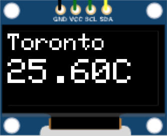

# ESP32 Weather WebServer

This project consists of a web server that sends a simple page to the user where a city can be searched and sent back to the server. Once the server has the city name and coordinates it will use a
simple web API to get weather information and display the result on an OLED display.

OLED




Web page


## Running the project

- Connect your ESP32 or compatible board to the PC or MAC
- Open this project with the Arduino IDE.
- Create a header file called `password.h` containing the two variables used inside `sketch_wather.ino`.

The header should look like this

```c++
#ifndef PASSWORD_H
#define PASSWORD_H

namespace Password {
const char *ssid = "YOUR_WIFI_SSID";
const char *password = "YOUR_WIFI_PASSWORD";
}  // namespace Password
#endif
```

- Compile and upload the sketch to your board.
- Open the IP address displayed in the OLED in a browser.
- Search and select a city.
